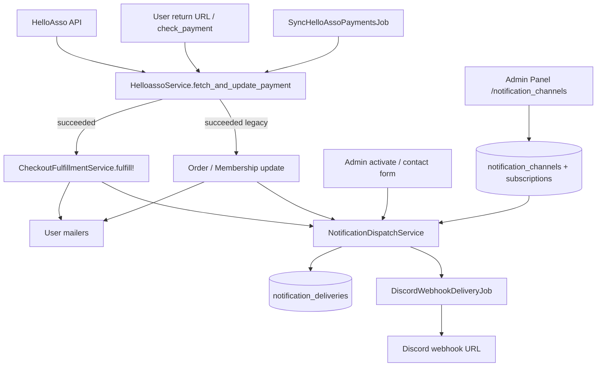

# DR-002: Discord webhook notifications (admin-configured)

## Status

**Implemented** (2026-06-09) on `Dev` — [DR-002 implementation PR](https://github.com/Grenoble-roller/Grenoble-Roller-Website/compare/staging...Dev) (Dev → staging, June 2026 v2.2).

Product scope locked 2026-06-08 (Florian); shipped in one release per decision table below.

**Product decisions (Florian, 2026-06-08):**

| Topic | Decision |
|-------|----------|
| Inbound | **Yes** — `contact_message.received`, `organizer_application.submitted` |
| Payment failures | **Yes** — `payment.failed` available in UI; **not pre-selected** on new webhooks |
| Admin / ops events | **Full catalog v1** — every relevant create/update/action exposed as a **toggle**; bénévoles enable only what they need |
| Channels | **Multi-webhook** in admin; no fixed split required — each channel picks its events |
| Scope | **Implement all catalog events in one release** (not phased by event type) |
| Trigger (payments) | Unchanged — after HelloAsso confirmation, not bare model callbacks |

**Related:** [DR-001 unified checkout](DR-001-unified-checkout-cart.md) · [HelloAsso payment sync](../../app/services/helloasso_service.rb) · Admin système [`docs/04-rails/admin-panel/08-systeme/`](../04-rails/admin-panel/08-systeme/README.md)

---

## Context

Ops and volunteers need **real-time alerts** when money-related or inbound actions happen (new paid order, new member, contact message, etc.). Email exists for end users (`OrderMailer`, `MembershipMailer`, …) but there is **no team channel notification** today.

A Discord **incoming webhook URL** is the preferred transport (simple HTTP POST, no bot token, fits homelab ops).

### Question from product

> Should we fire Discord notifications from model callbacks (`Order#paid`, `Membership#active`), or **after HelloAsso payment validation** — the same moment users see confirmation?

### Current payment confirmation flow (SSOT)

All online payments converge on **`HelloassoService.fetch_and_update_payment`**:

| Step | Code | What happens |
|------|------|----------------|
| 1 | User returns from HelloAsso | `CheckoutsController#show`, `Orders::PaymentsController`, `Memberships::PaymentsController` call `fetch_and_update_payment` |
| 2 | Background polling | `SyncHelloAssoPaymentsJob` → `Payment.poll_pending` → same method |
| 3 | HelloAsso state | `Confirmed` → local `payment.status = succeeded` |
| 4 | Unified cart | `CheckoutFulfillmentService.fulfill!` → order paid, membership active, event attendance registered + user emails |
| 5 | Legacy paths | Direct `order.update!(paid)` / `membership.update!(active)` in same service |

User-facing emails for unified checkout are sent **after fulfillment** in `CheckoutFulfillmentService#send_post_fulfillment_emails!`, not on raw model `after_update`.

Cash/check memberships and **manual admin activation** bypass HelloAsso — they need a **separate, opt-in event type**.

---

## Decision (accepted)

### 1. Trigger at **payment confirmation**, not generic model callbacks

**Dispatch Discord notifications from a single application service** invoked when a business event is **confirmed**, aligned with user-facing confirmation:

| Preferred hook | When |
|----------------|------|
| **Primary** | End of `HelloassoService.fetch_and_update_payment` when status transitions to `succeeded`, **after** `CheckoutFulfillmentService.fulfill!` (unified) or legacy order/membership updates |
| **Secondary** | Explicit admin actions (membership activate, cash/check validation) via dedicated event keys |
| **Tertiary** | Non-payment inbound events (contact form, organizer application) on `create` |

**Do not** rely on `Order#after_update` or `Membership#activate_if_paid` alone — those can fire on admin edits, replays, or status churn and duplicate polling calls.

### 2. Admin-managed webhooks in Admin Panel (Système)

Superadmins (level ≥ 70) configure **multiple Discord webhooks** with:

- Label (e.g. « Boutique », « Adhésions », « Ops général »)
- Webhook URL (stored encrypted, never shown in full after save)
- Global **enabled** toggle per webhook
- **Per-event toggles** (matrix: event × webhook)
- **Test notification** button (sends a sample embed, shows success/error inline)
- Optional: last delivery status / timestamp (phase 2)

**UI placement:** Admin Panel → **Système** → **Notifications** (`/admin-panel/notification_channels`), sidebar entry next to **Logs Mails** (same access level: SUPERADMIN ≥ 70).

### 3. Idempotent delivery

Each `(event_key, source_record, webhook_id)` is delivered **at most once** (delivery log table). Polling and return URL both call `fetch_and_update_payment` — idempotency is mandatory.

### 4. Async delivery

POST to Discord runs in **`DiscordWebhookDeliveryJob`** (Solid Queue) — never block payment reconciliation.

---

## Why payment confirmation is better than model callbacks

| Approach | Pros | Cons |
|----------|------|------|
| Model `after_update` on Order/Membership | Easy to wire | Fires on admin status edits, replays, non-HelloAsso paths; double fire with polling; hard to attach checkout context |
| **Confirmed event dispatcher (chosen)** | Same timing as user emails; one place; idempotent; rich payload from Payment/Checkout | Requires explicit list of non-HelloAsso events |

---

## Event catalog (full v1 — all toggles)

Events use stable **`event_key`** strings. **Every event below is implemented in v1** and exposed as a checkbox per webhook. Bénévoles / superadmins enable only what they need.

**Default subscriptions when creating a new webhook** (pre-checked in admin UI):

| Pre-checked | Event keys |
|-------------|------------|
| ✅ Yes | `order.paid`, `membership.activated`, `event_registration.paid`, `contact_message.received`, `organizer_application.submitted` |
| ❌ No | All other keys (including `payment.failed`) |

---

### 💰 Paiements & HelloAsso

| `event_key` | Trigger | Default |
|-------------|---------|---------|
| `order.paid` | Order → `paid` after HelloAsso `succeeded` | **On** |
| `membership.activated` | Membership `pending` → `active` after HelloAsso `succeeded` | **On** |
| `event_registration.paid` | Paid rando attendance confirmed via checkout fulfillment | **On** |
| `membership.activated_manual` | Admin « Activer » or cash/check path (no HelloAsso) | Off |
| `order.paid_manual` | Admin sets order to paid without HelloAsso | Off |
| `payment.failed` | HelloAsso `Refused` or terminal failure | Off *(available, Florian)* |
| `payment.abandoned` | HelloAsso checkout abandoned (>45 min, no order) | Off |
| `membership.payment_failed` | Membership payment failed (legacy path) | Off |

---

### 📥 Entrant public (sans HelloAsso)

| `event_key` | Trigger | Default |
|-------------|---------|---------|
| `contact_message.received` | `ContactMessage` created (after Turnstile) | **On** |
| `organizer_application.submitted` | New `OrganizerApplication` | **On** |
| `user.registered` | New `User` account | Off |

---

### 📋 Candidatures organisateur (admin)

| `event_key` | Trigger | Default |
|-------------|---------|---------|
| `organizer_application.approved` | Admin approves application | Off |
| `organizer_application.rejected` | Admin rejects application | Off |

---

### 🛒 Boutique — commandes & produits

| `event_key` | Trigger | Default |
|-------------|---------|---------|
| `order.created` | Admin or flow creates pending order | Off |
| `order.updated` | Admin edits order (non-status fields) | Off |
| `order.status_changed` | Status → preparation / shipped / cancelled / refund_* | Off |
| `product.created` | Admin creates product | Off |
| `product.updated` | Admin updates product | Off |
| `product.destroyed` | Admin deletes product | Off |
| `product_variant.created` | Admin creates variant | Off |
| `product_variant.updated` | Admin updates variant | Off |
| `product_variant.destroyed` | Admin deletes variant | Off |
| `product_variant.status_toggled` | Variant enabled/disabled | Off |

---

### 🎫 Adhésions

| `event_key` | Trigger | Default |
|-------------|---------|---------|
| `membership.created` | New membership record (pending / any origin) | Off |
| `membership.updated` | Admin edits membership | Off |
| `membership.destroyed` | Admin deletes membership | Off |

---

### 📅 Événements & randos

| `event_key` | Trigger | Default |
|-------------|---------|---------|
| `event.cancelled` | Event status → canceled (public model) | Off |
| `event.destroyed` | Admin deletes event | Off |
| `event.waitlist_notified` | Admin notifies waitlist | Off |
| `event.waitlist_converted` | Admin converts waitlist entry | Off |
| `attendance.created` | Admin creates attendance | Off |
| `attendance.updated` | Admin updates attendance | Off |
| `attendance.destroyed` | Admin removes attendance | Off |
| `route.created` | Admin creates route | Off |
| `route.updated` | Admin updates route | Off |
| `route.destroyed` | Admin deletes route | Off |
| `event_organizer.created` | Admin creates organizer entity | Off |
| `event_organizer.updated` | Admin updates organizer entity | Off |
| `event_organizer.destroyed` | Admin deletes organizer entity | Off |

---

### 🛼 Initiations & stock rollers

| `event_key` | Trigger | Default |
|-------------|---------|---------|
| `initiation.presences_updated` | Bulk presence update on initiation | Off |
| `initiation.volunteer_toggled` | Volunteer flag toggled on attendance | Off |
| `initiation.waitlist_notified` | Waitlist notification sent | Off |
| `initiation.waitlist_converted` | Waitlist → registration | Off |
| `initiation.material_returned` | Material return marked | Off |
| `roller_stock.created` | New roller stock entry | Off |
| `roller_stock.updated` | Stock quantity / size updated | Off |
| `roller_stock.destroyed` | Stock entry removed | Off |
| `roller_stock.return_all` | « Clôturer les prêts terminés » batch | Off |

---

### 🏠 Page d'accueil & partenaires

| `event_key` | Trigger | Default |
|-------------|---------|---------|
| `homepage_carousel.created` | New carousel slide | Off |
| `homepage_carousel.updated` | Slide edited | Off |
| `homepage_carousel.destroyed` | Slide removed | Off |
| `homepage_carousel.settings_updated` | Autoplay / interval changed | Off |
| `partner.created` | New partner | Off |
| `partner.updated` | Partner edited | Off |
| `partner.destroyed` | Partner removed | Off |

---

### 👥 Utilisateurs & système

| `event_key` | Trigger | Default |
|-------------|---------|---------|
| `user.created` | Admin creates user | Off |
| `user.updated` | Admin edits user (incl. role change) | Off |
| `user.destroyed` | Admin deletes user | Off |
| `role.created` | New role | Off |
| `role.updated` | Role permissions changed | Off |
| `role.destroyed` | Role deleted | Off |
| `maintenance.toggled` | Maintenance mode on/off | Off |
| `payment.destroyed` | SUPERADMIN deletes payment record | Off |
| `contact_message.destroyed` | Admin deletes contact message | Off |

---

### 🔧 Meta

| `event_key` | Trigger | Default |
|-------------|---------|---------|
| `test.ping` | Admin « Test notification » button only | N/A (never subscribed) |

---

### Explicitly out of scope

- Mirroring every user email (waitlist spot, renewal reminder, shipment email, …)
- Mission Control / Solid Queue job failures (use monitoring stack)
- HelloAsso inbound webhooks (polling remains SSOT per DR-001)
- High-frequency read-only admin views (index/show)

---

## Architecture



### Components (implementation target)

| Piece | Responsibility |
|-------|----------------|
| `NotificationChannel` | name, encrypted `webhook_url`, `enabled`, `created_by` |
| `NotificationSubscription` | `channel_id`, `event_key`, `enabled` |
| `NotificationDelivery` | idempotency + last error / HTTP status |
| `NotificationEventRegistry` | Single source of `event_key` → label, group, default_on, payload builder |
| `NotificationDispatchService` | `dispatch(event_key, source:, actor: nil)` → resolve channels, enqueue |
| `DiscordWebhookClient` | POST JSON embed; 429 retry with backoff |
| `AdminPanel::NotificationChannelsController` | CRUD, test action, subscription matrix |

### Dispatch hooks

| Source | Mechanism |
|--------|-----------|
| HelloAsso success / failure | End of `HelloassoService.fetch_and_update_payment` → payment.* / order.paid / membership.activated |
| Public create | `ContactMessage`, `OrganizerApplication`, `User` after_create |
| Admin mutations | Thin `after_commit` on models **or** concern `Notifiable` included in admin controllers — prefer **single `NotificationDispatchService.dispatch` call** at end of successful controller action to avoid noise on failed validations |
| Order status | `Order#notify_status_change` may call dispatch for `order.status_changed` (distinct from `order.paid`) |

### Canonical dispatch call (payment success)

```ruby
# Inside HelloassoService.fetch_and_update_payment, after fulfillment / legacy updates:
if new_status == "succeeded" && previous_status != "succeeded"
  NotificationDispatchService.dispatch_payment_succeeded!(payment)
end
```

`dispatch_payment_succeeded!` expands one Payment into **one or more event payloads**:

- Each related **paid Order** → `order.paid`
- Each **activated Membership** → `membership.activated`
- Each **fulfilled event Attendance** → `event_registration.paid`

Unified checkout: derive from `payment.checkouts` + `checkout_lines` after `fulfill!`.

---

## Admin Panel UX spec

**Route:** `namespace :admin_panel` → `resources :notification_channels` + member `post :test`

**Access:** `AdminPanel::NotificationChannelPolicy` — index/show/create/update/destroy/test: **level ≥ 70** (SUPERADMIN).

### Index (`/admin-panel/notification_channels`)

| Column | Content |
|--------|---------|
| Name | « Alertes boutique » |
| Status | Enabled / Disabled badge |
| Events | Count of enabled subscriptions |
| Last test | Timestamp + ✓/✗ |
| Actions | Edit · Test · Delete |

Button: **Ajouter un webhook Discord**

### Form (new / edit)

1. **Nom** (required) — e.g. « Discord #ops »
2. **URL du webhook** (required on create; optional on update = leave blank to keep) — password field
3. **Activer ce webhook** — master toggle
4. **Événements** — checkboxes grouped by section (💰 Paiements, 📥 Entrant, 🛒 Boutique, …) with « Tout cocher / Tout décocher » per group
5. **Actions:** Enregistrer · **Envoyer une notification de test** · Annuler

Pre-selection on **new** webhook matches [default table](#event-catalog-full-v1--all-toggles) above.

### Test notification

- POST `test_notification_channel_path`
- Sends embed: « Test Grenoble Roller — [channel name] — [timestamp] » + link to admin
- Flash: success or Discord error body (truncated)
- Does **not** write to idempotency log (or uses `event_key: test.ping`)

### Sidebar menu

Add under SUPERADMIN block (after Logs Mails):

```erb
<!-- NOTIFICATIONS (SUPERADMIN >= 70) -->
<i class="bi bi-bell"></i> Notifications
→ admin_panel_notification_channels_path
```

Cross-link from [`08-systeme`](../04-rails/admin-panel/08-systeme/README.md) README.

---

## Discord message format (v1)

Use **embeds** (one per event), French labels, admin deep links:

**Example — `order.paid`**

```json
{
  "embeds": [{
    "title": "Nouvelle commande payée",
    "color": 5814783,
    "fields": [
      { "name": "Commande", "value": "#42 (abc123)", "inline": true },
      { "name": "Montant", "value": "34,00 €", "inline": true },
      { "name": "Client", "value": "Marie Dupont", "inline": true }
    ],
    "footer": { "text": "Grenoble Roller Admin" },
    "url": "https://…/admin-panel/orders/42"
  }]
}
```

Keep payloads **PII-minimal**: no full address in Discord; link to admin for detail.

---

## Security & compliance

| Topic | Rule |
|-------|------|
| Webhook URL | **Encrypt at rest** (`ActiveRecord::Encryption` or lockbox); mask in UI (`https://discord…***`) |
| Secrets in repo | **Never** — no ENV for prod webhook URLs in v1 (DB admin config); optional `DISCORD_WEBHOOK_URL` fallback deprecated |
| Access | SUPERADMIN only; audit `created_by` / `updated_by` |
| SSRF | Validate URL host ∈ `{ discord.com, discordapp.com }` only |
| Rate limits | Discord 429 → job retry; log failure on channel |
| RGPD | Discord is third-party processor; document in privacy policy if enabled in prod |

---

## Data model (sketch)

```ruby
# notification_channels
#   name:string, webhook_url_ciphertext:text, enabled:boolean,
#   last_tested_at:datetime, last_test_status:string, timestamps

# notification_subscriptions
#   notification_channel_id:fk, event_key:string, enabled:boolean
#   index unique [channel_id, event_key]

# notification_deliveries
#   notification_channel_id:fk, event_key:string,
#   source_type:string, source_id:bigint,  # polymorphic (Payment, Order, …)
#   status:string, http_code:integer, error_message:text, delivered_at:datetime
#   index unique [channel_id, event_key, source_type, source_id]
```

---

## Implementation plan

Single release — **full event catalog** + admin UI. Estimated **~4–5 human days**.

| Step | Scope |
|------|-------|
| 1 | Migrations, models, `NotificationEventRegistry`, encryption, policies |
| 2 | `NotificationDispatchService`, `DiscordWebhookClient`, delivery job + idempotency |
| 3 | HelloAsso hooks (paid + failed/abandoned) |
| 4 | Public inbound hooks (contact, organizer application, optional user.registered) |
| 5 | Admin controller hooks (all catalog keys — use registry to avoid drift) |
| 6 | Admin CRUD UI + grouped checkbox matrix + test button |
| 7 | RSpec (registry, dispatch, job WebMock, admin test action, idempotency) |

### Staging safety (default)

Dispatch is **no-op** unless at least one enabled channel exists **and** (`Rails.env.production?` **or** `ENV["ALLOW_DISCORD_NOTIFICATIONS"] == "true"`). Prevents staging sandbox from spamming prod Discord unless explicitly enabled.

### Files (expected touch)

| Area | Paths |
|------|-------|
| Models | `app/models/notification_channel.rb`, `notification_subscription.rb`, `notification_delivery.rb` |
| Services | `app/services/notification_dispatch_service.rb`, `discord_webhook_client.rb` |
| Jobs | `app/jobs/discord_webhook_delivery_job.rb` |
| Hook | `app/services/helloasso_service.rb` (post-success dispatch) |
| Admin | `app/controllers/admin_panel/notification_channels_controller.rb`, views, policy |
| Routes | `config/routes.rb` |
| Menu | `app/views/admin/shared/_menu_items.html.erb` |
| Specs | models, dispatch service, job, request spec admin test action |

---

## Rollback

- Disable all channels in admin UI (master toggle) — immediate, no deploy.
- Remove dispatch call from `HelloassoService` — stops all payment-triggered alerts.
- Drop tables — only if feature removed entirely.

---

## QA checklist (staging)

- [ ] Create webhook pointing to private Discord test channel
- [ ] Test button receives embed
- [ ] HelloAsso sandbox: product order → exactly **one** Discord message per channel/subscription
- [ ] Repeat return URL + polling → **no duplicate** messages
- [ ] Unified checkout with membership + product → two event types if both subscribed
- [ ] Disabled event toggle → no message
- [ ] Disabled channel → no message
- [ ] Non-superadmin → 403 on routes
- [ ] Invalid URL host → validation error on save

---

## Alternatives considered

| Option | Rejected because |
|--------|------------------|
| Single `DISCORD_WEBHOOK_URL` ENV | No per-event toggles, no multi-channel, requires redeploy |
| Model callbacks only | Duplicates, false positives, misaligned with HelloAsso truth |
| HelloAsso native webhooks | Out of scope v1 (polling SSOT); can add later as extra trigger into same dispatcher |
| Slack / n8n | Discord chosen by ops; architecture allows second `provider` column later |
| Email to ops alias | Slower, no real-time; Discord preferred for volunteers |

---

## Resolved questions (Florian, 2026-06-08)

| # | Question | Answer |
|---|----------|--------|
| 1 | Default channels | Multi-webhook in admin; bénévoles configure per channel |
| 2 | Contact + organizer | **Yes** — default **on** for new webhooks |
| 3 | `payment.failed` | **Yes** in catalog; default **off** |
| 4 | Admin CRUD | **Full catalog v1** — all create/update/destroy actions as toggles |
| 5 | Phasing | **One release** — not incremental by event group |
| 6 | Staging | Block unless `ALLOW_DISCORD_NOTIFICATIONS=true` (see implementation plan) |
| 7 | Cash/check manual membership | Available as `membership.activated_manual`; default **off** |

---

## Implementation notes (2026-06-09)

| Item | Detail |
| --- | --- |
| Admin UI | `/admin-panel/notification-channels` — SUPERADMIN (level ≥ 70); sidebar **Notifications** after **Logs Mails** |
| Catalog | ~65 event keys via `NotificationEventRegistry`; grouped checkboxes + « Tout cocher / Tout décocher » per group |
| QA tools | Per-event sample embed + batch « Envoyer tous les exemples » (async job; rate-limit aware) |
| Dispatch gate | Production always; staging/dev only if `ALLOW_DISCORD_NOTIFICATIONS=true` |
| Payment hooks | After HelloAsso confirmation in `HelloassoService` (not bare model callbacks) |
| Known gaps | `organizer_application.submitted` (no public submit flow on `Dev` yet); `event.cancelled` (no dedicated admin cancel action wired) |

---

## Maintaining this document

On future changes:

1. Keep `status: implemented` and link PR/issue when scope changes.
2. Sync checklist in [`docs/04-rails/admin-panel/08-systeme/`](../04-rails/admin-panel/08-systeme/README.md).
3. Add ENV rows to [`release-dev-to-staging-2026-06.md`](release-dev-to-staging-2026-06.md) when flags change.
4. Add one line to [`CHANGELOG.md`](CHANGELOG.md) on merge.

---

## References

- [`HelloassoService#fetch_and_update_payment`](../../app/services/helloasso_service.rb)
- [`CheckoutFulfillmentService`](../../app/services/checkout_fulfillment_service.rb)
- [`CheckoutsController#show`](../../app/controllers/checkouts_controller.rb) (return from HelloAsso)
- [`SyncHelloAssoPaymentsJob`](../../app/jobs/sync_hello_asso_payments_job.rb)
- [Discord webhook docs](https://discord.com/developers/docs/resources/webhook#execute-webhook)
- [DR-001 payment sync model](DR-001-unified-checkout-cart.md)
