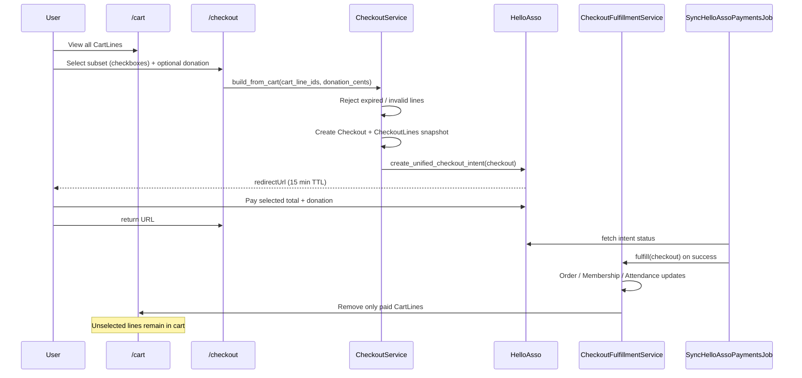

# MASTER plan — Unified account cart & checkout

**Authoritative implementation guide for AI agents.**  
Human product decisions locked **2026-06-08** (Florian).  
Companion UX copy: [`docs/09-product/unified-cart-ux.md`](../09-product/unified-cart-ux.md).  
Decision record: [`DR-001-unified-checkout-cart.md`](DR-001-unified-checkout-cart.md).

---

## A. Executive summary

### Résumé produit (FR)

Tous les paiements en ligne (boutique, adhésions, randos payantes) passent par **Mon panier** → **Paiement** → **HelloAsso**. L’utilisateur peut **payer une sélection** de lignes (cases à cocher) ; le reste reste dans le panier. Le **don libre** est proposé **à chaque checkout**, y compris panier sans article boutique. Les **initiations** ne sont **jamais payantes** (adhésion / essai gratuit inchangés).

### Product goal (EN)

Replace three siloed HelloAsso flows (shop `session[:cart]` → `Order`, membership direct redirect, free-only event registration) with:

**`CartLine` (DB, per user) → `Checkout` (subset of lines) → one HelloAsso intent → `CheckoutFulfillmentService` fan-out.**

### Locked decisions (2026-06-08)

| # | Decision | Implementation note |
|---|----------|---------------------|
| 1 | **Optional donation on every checkout** | Always render donation block on `/checkout`; amount added to HelloAsso `totalAmount`; stored on `Checkout#donation_cents` |
| 2 | **Partial cart payment** | Checkout accepts `cart_line_ids[]`; only selected lines snapshotted; unselected `CartLine` rows remain |
| 3 | **Initiations never paid** | `Event::Initiation` excluded from `payment_required`; no cart lines; existing `Attendance#can_register_to_initiation` gate unchanged |
| 4 | **Single payment rail** | All online pay → account cart → unified checkout → HelloAsso |

### Current codebase baseline (explored 2026-06-08)

| Area | Today | Key files |
|------|-------|-----------|
| Shop cart | `session[:cart]` hash `{ variant_id => qty }` | `CartsController`, `ApplicationHelper#cart_items_count` |
| Shop checkout | `GET/POST /orders` → `Order` + `HelloassoService.create_checkout_intent` | `OrdersController`, `app/views/orders/new.html.erb` (donation UI) |
| Memberships | Direct HelloAsso after `create` | `MembershipsController`, `Memberships::PaymentsController` |
| Events (randos) | Immediate `Attendance` `registered` | `Events::AttendancesController#create` |
| HelloAsso sync | Polling every 5 min | `SyncHelloAssoPaymentsJob`, `HelloassoService#fetch_and_update_payment` (orders + memberships only; **no attendances yet**) |
| Initiations | Member / free-trial validation only | `Attendance#can_register_to_initiation`, `Event::Initiation` STI |

### Code audit findings (incorporated — 2026-06-08)

These items are **documented only** or **partially implemented** today; agents must not assume they exist in code until the relevant wave lands.

| Finding | Current code | Plan action |
|---------|--------------|-------------|
| No `CartLine` model | Cart is `session[:cart]` in `CartsController`, `OrdersController#build_cart_items`, `ApplicationHelper#cart_items_count` | Wave 1 — DB `cart_lines` + flag shim |
| No `payment_required` on `Event` | `Event#price_cents` display-only; no online pay for randos | Wave 2 — migration + `Event#requires_online_payment?` |
| No `payment_expires_at` on `Attendance` | `Attendance` enum has `pending` (used for **waitlist** holds) and `paid`; paid randos need a distinct pending-payment path | Wave 2 — `payment_expires_at` distinguishes payment hold from waitlist `pending` |
| Events register immediately | `Events::AttendancesController#create` sets `status: "registered"` always | Wave 2 — `pending` + cart line when `requires_online_payment?` |
| Memberships bypass cart | `Memberships::PaymentsController` → `create_membership_checkout_intent` / `create_multiple_memberships_checkout_intent` | Wave 3 — `CartLineService.add_membership!`; Wave 6 — remove direct pay |
| HelloAsso fulfillment | `fetch_and_update_payment` updates `Order` + `Membership` only; **no attendances** | Wave 4 — `CheckoutFulfillmentService` fan-out |
| Initiations never paid | `InitiationsController` forces `price_cents: 0`; separate `Initiations::AttendancesController` | **Out of scope** — guard `payment_required` on STI |
| Donation optional on shop only | `OrdersController#create` reads `params[:donation_cents]`; UI in `orders/new.html.erb` | Wave 4 — donation block **always** on `/checkout` |
| Polling interval | `SyncHelloAssoPaymentsJob` every 5 min; HelloAsso redirect TTL 15 min | `ExpireCartLinesJob` every 2 min releases seats independently of poll |

**Key file references (today):**

- `app/controllers/carts_controller.rb` — session cart CRUD
- `app/controllers/orders_controller.rb` — shop checkout + donation + clears session
- `app/controllers/memberships/payments_controller.rb` — direct HelloAsso for memberships
- `app/controllers/events/attendances_controller.rb` — immediate registration
- `app/services/helloasso_service.rb` — `create_checkout_intent`, `create_membership_checkout_intent`, `fetch_and_update_payment`
- `spec/requests/carts_spec.rb`, `spec/requests/orders_spec.rb`, `spec/services/helloasso_service_spec.rb` — extend per wave

### Scope

- **In:** Waves 0–6 below; feature flag `UNIFIED_CART_ENABLED`; RSpec for all new behaviour.
- **Out:** Paid initiations; HelloAsso webhooks; automated refunds; guest checkout without account.

### Estimate

**4–6 agent iteration cycles** (~12–20 human review days with buffer). One PR per wave preferred.

---

## B. Architecture

### Domain models

```
User
 ├── has_many :cart_lines
 ├── has_many :checkouts
 └── (existing) orders, memberships, attendances

CartLine
 ├── user_id (FK, NOT NULL)
 ├── line_type enum: product_variant | membership | event_registration
 ├── reference_type + reference_id (polymorphic)
 ├── amount_cents, label, quantity (default 1 for non-products)
 ├── expires_at (nullable; required for event_registration)
 ├── metadata jsonb (sku, event_id, child_name, …)
 └── unique index preventing duplicate payable rows per user+reference+type

Checkout
 ├── user_id, status enum: pending | processing | paid | failed | abandoned
 ├── subtotal_cents, donation_cents, total_cents
 ├── payment_id (FK optional until intent created)
 ├── metadata jsonb (helloasso_intent_id, selected_line_ids, …)
 └── has_many :checkout_lines

CheckoutLine (immutable snapshot at pay time)
 ├── checkout_id, cart_line_id (nullable after cart line removed)
 ├── line_type, reference_type, reference_id
 ├── amount_cents, label, quantity, metadata jsonb

Event
 └── + payment_required boolean, default false

Attendance
 └── + payment_expires_at datetime (nullable)
```

### Service layer

| Service | Responsibility |
|---------|----------------|
| `CartLineService` | add / remove / list / merge_session / expire_stale |
| `CheckoutService` | `build_from_cart(user, cart_line_ids:, donation_cents:)` — validate subset, create `Checkout` + `CheckoutLine`s |
| `HelloassoService` | `create_unified_checkout_intent(checkout)` — sum selected lines + donation |
| `CheckoutFulfillmentService` | On payment success: products → `Order`; memberships → `active`; events → `registered` |
| `CartSessionMergeService` | On login: merge `session[:cart]` → `CartLine` once, clear session |

### Partial payment flow



### Initiations — explicit out of scope

- **Never** set `payment_required` on `Event::Initiation` (model validation + admin guard).
- **`Event#requires_online_payment?`** → `payment_required? && !is_a?(Event::Initiation)`.
- Registration stays via `Initiations::AttendancesController` with existing membership / free-trial rules (`Attendance#can_register_to_initiation`).
- **Do not** add `CartLine` or HelloAsso paths for initiations in this epic.

### Feature flag

| Flag | Default | Behaviour |
|------|---------|-----------|
| `UNIFIED_CART_ENABLED` | `false` (env) | When `false`: legacy session cart + direct membership HelloAsso unchanged. When `true`: DB cart, unified checkout, deprecated direct pay hidden. |

Expose helper: `UnifiedCart.enabled?` reading `ENV.fetch("UNIFIED_CART_ENABLED", "false") == "true"`.

---

## C. Implementation waves (0–6)

> **7 numbered waves** (0 = foundation, 1–4 = core, 5–6 = polish & release). Product epic refers to **6 feature waves** after foundation.

---

### Wave 0 — Foundation & UX spec

**Goal:** Docs, flag, HelloAsso mixed-metadata spike; no production behaviour change.

**Dependencies:** None.

#### Migrations

None.

#### Models / config

- `config/initializers/unified_cart.rb` — `module UnifiedCart; def self.enabled?; end`.
- `.env.example` — `UNIFIED_CART_ENABLED=false`.

#### Services

None (spike only in spec or script).

#### Controllers / routes

None.

#### Views

None.

#### Jobs

None.

#### Mailers

None.

#### Admin

None.

#### Feature flag

Add initializer + document in ops README.

#### RSpec matrix

| File | Specs |
|------|-------|
| `spec/lib/unified_cart_spec.rb` | `describe UnifiedCart` → `context "when UNIFIED_CART_ENABLED is true"` → `it "returns enabled"`; `context "when unset or false"` → `it "returns disabled"` |
| `spec/services/helloasso_service_spec.rb` | `describe ".build_unified_checkout_intent_payload"` → `it "includes product, membership, and event line metadata"`; `it "adds donation line when donation_cents positive"`; `it "sets totalAmount to subtotal plus donation"` |

#### FactoryBot

None.

#### DoD

- [x] DR-001 + 3-phases plan link to this MASTER doc.
- [x] `unified-cart-ux.md` updated (donation + partial payment).
- [x] Flag present; full suite green.

---

### Wave 1 — Account cart + shop migration

**Goal:** Persist shop lines in `cart_lines`; session shim + login merge; shop parity behind flag.

**Dependencies:** Wave 0.

#### Migrations

`db/migrate/TIMESTAMP_create_cart_lines.rb`:

```ruby
create_table :cart_lines do |t|
  t.references :user, null: false, foreign_key: true
  t.string :line_type, null: false
  t.references :reference, polymorphic: true, null: false
  t.integer :amount_cents, null: false, default: 0
  t.string :label, null: false
  t.integer :quantity, null: false, default: 1
  t.datetime :expires_at
  t.jsonb :metadata, null: false, default: {}
  t.timestamps
end
add_index :cart_lines, [:user_id, :line_type]
add_index :cart_lines, [:user_id, :expires_at]
add_index :cart_lines, [:user_id, :reference_type, :reference_id, :line_type],
          unique: true, name: "index_cart_lines_unique_per_user_reference"
```

#### Models

**`app/models/cart_line.rb`**

- `belongs_to :user`
- `belongs_to :reference, polymorphic: true`
- `enum :line_type, { product_variant: "product_variant", membership: "membership", event_registration: "event_registration" }`
- Validations: `amount_cents >= 0`, `quantity >= 1`, `label` presence
- Scopes: `for_user(user)`, `active` (not expired), `expired`, `ordered_by_created`
- `#expired?` → `expires_at.present? && expires_at <= Time.current`
- `#subtotal_cents` → `amount_cents * quantity`

**`app/models/user.rb`** — `has_many :cart_lines, dependent: :destroy`

#### Services

**`app/services/cart_line_service.rb`**

```ruby
class CartLineService
  def self.add_product!(user, variant:, quantity: 1)       # merge qty if line exists
  def self.update_product_quantity!(user, variant:, quantity:)
  def self.remove!(user, cart_line_id:)
  def self.clear!(user)
  def self.list(user)                                      # Array<CartLine>, preload refs
  def self.total_cents(user)
  def self.count(user)
  def self.expire_stale!(user = nil)                       # delete expired lines
end
```

**`app/services/cart_session_merge_service.rb`**

```ruby
def self.merge!(user, session_cart:)                       # session hash → product CartLines; clear session
```

#### Controllers / routes

| Path | Action | Notes |
|------|--------|-------|
| `GET /cart` | `CartsController#show` | When flag on: `@cart_lines = CartLineService.list(current_user)` (require login for payable ops) |
| `POST /cart/add_item` | `#add_item` | Flag on + signed in → `CartLineService.add_product!`; else legacy session |
| `PATCH /cart/update_item` | `#update_item` | Same branching |
| `DELETE /cart/remove_item` | `#remove_item` | Accept `cart_line_id` OR legacy `variant_id` |
| `DELETE /cart/clear` | `#clear` | Clear DB or session per flag |

**`SessionsController#create`** — after successful sign-in, call `CartSessionMergeService.merge!` when flag enabled.

#### Views / partials

| Path | Action |
|------|--------|
| `app/views/carts/show.html.erb` | Modify — product section from `@cart_lines`; keep legacy session branch when flag off |
| `app/views/carts/_cart_line_product.html.erb` | Create — thumbnail, qty stepper, subtotal, remove |
| `app/helpers/application_helper.rb` | Modify — `cart_items_count` uses `CartLineService.count(current_user)` when flag + signed in |
| `app/views/layouts/_navbar.html.erb` | Modify — badge uses helper (no logic change if helper updated) |

#### Jobs

**`app/jobs/expire_cart_lines_job.rb`** — `CartLineService.expire_stale!` (event lines in Wave 2).

**`config/recurring.yml`** — schedule every 2 minutes (when Wave 2 adds event expiry side effects, job already running).

#### Mailers

None.

#### Admin

None.

#### Feature flag

All new cart paths gated: `UnifiedCart.enabled? && user_signed_in?`.

#### RSpec matrix

| File | Specs |
|------|-------|
| `spec/models/cart_line_spec.rb` | `describe CartLine` → `describe "validations"` → `it "requires label"`; `it "requires non-negative amount_cents"`; `describe "#expired?"` → `it "returns true when expires_at in the past"`; `it "returns false when expires_at nil"`; `describe "uniqueness"` → `it "prevents duplicate product_variant line for same user and variant"` |
| `spec/services/cart_line_service_spec.rb` | `describe CartLineService` → `describe ".add_product!"` → `it "creates a cart line"`; `it "merges quantity when line already exists"`; `it "caps quantity to available stock"`; `describe ".remove!"` → `it "destroys the line"`; `describe ".list"` → `it "excludes expired lines by default when option set"`; `describe ".expire_stale!"` → `it "deletes expired lines"` |
| `spec/services/cart_session_merge_service_spec.rb` | `describe CartSessionMergeService` → `it "creates CartLines from session cart"`; `it "clears session cart after merge"`; `it "is idempotent when session empty"` |
| `spec/requests/carts_spec.rb` | Extend → `context "when UNIFIED_CART_ENABLED"` → `describe "GET /cart"` → `it "requires authentication"`; `it "lists DB cart lines"`; `describe "POST /cart/add_item"` → `it "creates CartLine instead of session"`; `context "when flag disabled"` → `it "keeps session cart behaviour"` |
| `spec/requests/sessions_spec.rb` | Create or extend → `it "merges session cart into DB cart on sign in when unified cart enabled"` |

#### FactoryBot

**`spec/factories/cart_lines.rb`**

```ruby
factory :cart_line do
  user
  line_type { :product_variant }
  association :reference, factory: :product_variant
  amount_cents { 2000 }
  label { "Test product" }
  quantity { 1 }
end
```

#### DoD

- [x] Shop add/update/remove works via DB cart when flag on.
- [x] Login merges session cart once.
- [x] Legacy session cart unchanged when flag off.
- [x] Wave 1 specs green.

---

### Wave 2 — Paid events (randos only)

**Goal:** `payment_required` randos → pending attendance + cart line with 15 min hold; waitlist blocked.

**Dependencies:** Wave 1.

#### Migrations

```ruby
add_column :events, :payment_required, :boolean, default: false, null: false
add_column :attendances, :payment_expires_at, :datetime
add_index :attendances, :payment_expires_at
```

#### Models

**`Event`**

- `def requires_online_payment?` → `payment_required? && !is_a?(Event::Initiation)`
- `validate :initiation_cannot_require_payment` — error if `is_a?(Event::Initiation) && payment_required?`
- `def occupied_spots_for_capacity` — include `pending` attendances when `requires_online_payment?`
- Update `full?`, `remaining_spots`, `has_available_spots?` to use occupied count for paid events

**`Attendance`**

- Allow `status: pending` for payment hold (already in enum)
- `scope :payment_pending, -> { where(status: :pending).where.not(payment_expires_at: nil) }`

**`CartLineService`**

```ruby
def self.add_event_registration!(user, attendance:, event:)
  # amount from event.price_cents, expires_at 15.minutes.from_now, label from event title
end
def self.release_event_line!(cart_line)
  # destroy attendance (pending) + cart_line
end
```

**`ExpireCartLinesJob`** — for `event_registration` lines past `expires_at`: call `release_event_line!`.

#### Controllers / routes

**`Events::AttendancesController#create`**

- If `@event.requires_online_payment?` && `UnifiedCart.enabled?`:
  - Create `Attendance` `pending`, `payment_expires_at: 15.minutes.from_now`
  - `CartLineService.add_event_registration!`
  - Flash + redirect to cart (no immediate email confirmation)
- Else: unchanged (immediate `registered`)

**`Events::WaitlistEntriesController`** — block create when `@event.requires_online_payment?`

#### Views / partials

| Path | Action |
|------|--------|
| `app/views/carts/_cart_line_event.html.erb` | Create — countdown, participant name |
| `app/views/carts/show.html.erb` | Add Events section |
| `app/views/events/show.html.erb` | Paid CTA « Réserver ma place »; hide waitlist when `requires_online_payment?` |
| `app/views/events/_registration_form.html.erb` (or equivalent) | Adjust copy |

#### Admin

| Path | Action |
|------|--------|
| `app/views/events/_form.html.erb` or admin form partial | Checkbox `payment_required` + help text |
| `app/controllers/events_controller.rb` | Permit `:payment_required` in strong params |
| `Event::Initiation` forms | Do not show checkbox (or disabled with note) |

#### Jobs

Extend `ExpireCartLinesJob` for event release + seat free.

#### Mailers

- **Defer** `EventMailer.attendance_confirmed` until fulfillment (Wave 4), not on pending add.

#### Feature flag

Paid-event cart path only when `UnifiedCart.enabled?`. Admin can set `payment_required` regardless (dormant until flag on).

#### RSpec matrix

| File | Specs |
|------|-------|
| `spec/models/event_spec.rb` | `describe "#requires_online_payment?"` → `it "returns true when payment_required on rando"`; `it "returns false for Initiation even if payment_required true"`; `describe "validations"` → `it "rejects payment_required on Initiation"`; `describe "#full?"` → `context "when payment_required"` → `it "counts pending attendances toward capacity"` |
| `spec/models/attendance_spec.rb` | `describe "payment pending registration"` → `it "allows pending status with payment_expires_at"` |
| `spec/services/cart_line_service_spec.rb` | `describe ".add_event_registration!"` → `it "creates cart line linked to attendance"`; `it "sets expires_at to 15 minutes"`; `describe ".release_event_line!"` → `it "destroys pending attendance and cart line"` |
| `spec/jobs/expire_cart_lines_job_spec.rb` | Create → `it "releases expired event cart lines"`; `it "frees event seat when line expires"` |
| `spec/requests/events/attendances_spec.rb` | Create file or extend → `context "paid event with unified cart"` → `it "creates pending attendance and cart line"`; `it "does not send confirmation email immediately"`; `context "free event"` → `it "registers immediately"` |
| `spec/requests/events/waitlist_entries_spec.rb` | `it "blocks waitlist when payment_required"` |
| `spec/models/event/initiation_spec.rb` | `it "cannot enable payment_required"` |

#### FactoryBot

- `spec/factories/events.rb` — trait `:payment_required`
- `spec/factories/cart_lines.rb` — trait `:event_registration`

#### DoD

- [x] Paid rando → cart + timer; expiry releases seat.
- [x] Free randos unchanged.
- [x] Initiations unaffected.
- [x] Waitlist blocked on paid randos.

---

### Wave 3 — Memberships into cart

**Goal:** Online membership create adds `CartLine` instead of immediate HelloAsso redirect.

**Dependencies:** Wave 1 (cart_lines table). Can parallelize UI with Wave 2 after Wave 1 merges.

#### Migrations

None (reuse `cart_lines`).

#### Models

**`CartLineService`**

```ruby
def self.add_membership!(user, membership:)
  # one line per membership (multi-child = multiple lines)
end
```

**Guards:** `membership.pending?`, `membership.health_questionnaire_complete?` before add (controller or service).

#### Controllers / routes

**`MembershipsController`** (create paths: adult, teen, child)

- When online pay && `UnifiedCart.enabled?`:
  - Create `Membership` `pending` (existing logic)
  - `CartLineService.add_membership!`
  - Redirect with flash « Adhésion ajoutée au panier »
  - **Do not** call HelloAsso here

**`Memberships::PaymentsController`**

- When flag on: `create` / `create_multiple` redirect to `cart_path` with notice (deprecated).

**Cash/check path** — unchanged (`create_without_payment`).

#### Views / partials

| Path | Action |
|------|--------|
| `app/views/carts/_cart_line_membership.html.erb` | Create — season, name, amount |
| `app/views/carts/show.html.erb` | Memberships section |
| `app/views/memberships/show.html.erb` | Hide « Payer HelloAsso » when flag on; link to cart if pending line exists |

#### Admin

None.

#### Jobs

None.

#### Mailers

None until fulfillment.

#### Feature flag

Direct pay buttons hidden when `UnifiedCart.enabled?`.

#### RSpec matrix

| File | Specs |
|------|-------|
| `spec/services/cart_line_service_spec.rb` | `describe ".add_membership!"` → `it "creates membership cart line"`; `it "uses membership total_amount_cents"` |
| `spec/requests/memberships_spec.rb` | `context "unified cart enabled"` → `describe "POST /memberships"` → `it "creates pending membership and cart line"`; `it "does not redirect to HelloAsso"`; `it "blocks when health questionnaire incomplete"`; `describe "cash/check"` → `it "does not create cart line"` |
| `spec/requests/memberships/payments_spec.rb` | Create → `context "unified cart enabled"` → `it "redirects to cart with deprecation notice"` |

#### FactoryBot

- `cart_line` trait `:membership`

#### DoD

- [x] Adult / teen / multi-child → cart lines.
- [x] Cash/check unchanged.
- [x] Direct HelloAsso deprecated behind flag.

---

### Wave 4 — Unified checkout, partial payment & HelloAsso

**Goal:** Single checkout for selected cart lines + mandatory donation UI + HelloAsso + fulfillment.

**Dependencies:** Waves 1–3.

#### Migrations

```ruby
create_table :checkouts do |t|
  t.references :user, null: false, foreign_key: true
  t.string :status, null: false, default: "pending"
  t.integer :subtotal_cents, null: false, default: 0
  t.integer :donation_cents, null: false, default: 0
  t.integer :total_cents, null: false, default: 0
  t.references :payment, foreign_key: true
  t.jsonb :metadata, null: false, default: {}
  t.timestamps
end
add_index :checkouts, [:user_id, :status]

create_table :checkout_lines do |t|
  t.references :checkout, null: false, foreign_key: true
  t.bigint :cart_line_id
  t.string :line_type, null: false
  t.references :reference, polymorphic: true, null: false
  t.integer :amount_cents, null: false
  t.string :label, null: false
  t.integer :quantity, null: false, default: 1
  t.jsonb :metadata, null: false, default: {}
  t.timestamps
end
add_index :checkout_lines, :cart_line_id
```

Optional: `add_reference :checkouts, :checkout, foreign_key: true` on `orders` for traceability (or store in metadata only).

#### Models

**`Checkout`**

- `enum status: { pending: "pending", processing: "processing", paid: "paid", failed: "failed", abandoned: "abandoned" }`
- `has_many :checkout_lines, dependent: :destroy`
- `belongs_to :user`, `belongs_to :payment, optional: true`
- Validations: `total_cents == subtotal_cents + donation_cents`

**`CheckoutLine`** — read-only after create (no update callbacks except via admin audit).

**`Payment`** — optional `has_many :checkouts` or link via metadata `checkout_id`.

#### Services

**`CheckoutService`**

```ruby
def self.build_from_cart(user, cart_line_ids:, donation_cents: 0)
  # 1. Load lines belonging to user
  # 2. Reject empty selection → raise CheckoutService::EmptySelectionError
  # 3. Reject expired lines → raise CheckoutService::ExpiredLinesError
  # 4. Validate stock (products), seats (events), membership rules
  # 5. Create Checkout + CheckoutLines snapshot
  # 6. For product lines: create Order pending + reserve stock (subset only)
  # 7. Return checkout
end
```

**`HelloassoService`**

```ruby
def self.build_unified_checkout_intent_payload(checkout, back_url:, error_url:, return_url:)
def self.create_unified_checkout_intent(checkout, back_url:, error_url:, return_url:)
  # metadata: checkoutId, lineTypes, localOrderIds, membershipIds, attendanceIds, donationCents
```

**`CheckoutFulfillmentService`**

```ruby
def self.fulfill!(checkout, payment:)
  # Idempotent; per checkout_line line_type fan-out
  # products: mark order paid (already created at build)
  # memberships: status active
  # events: attendance registered, clear payment_expires_at, link payment_id
  # Remove fulfilled cart_lines only
end
```

**`HelloassoService#fetch_and_update_payment`** — extend:

- Detect checkout via metadata or `payment.checkouts`
- On success call `CheckoutFulfillmentService.fulfill!`
- Keep legacy order/membership paths for old payments

#### Controllers / routes

| Method | Path | Controller#action |
|--------|------|-------------------|
| GET | `/checkout` | `CheckoutsController#new` |
| POST | `/checkout` | `CheckoutsController#create` |
| GET | `/checkout/:id` | `CheckoutsController#show` (return / poll status) |
| GET | `/checkout/:id/status` | `CheckoutsController#status` (JSON, reuse membership poll pattern) |
| POST | `/checkout/:id/check_payment` | `CheckoutsController#check_payment` |

**Params (create):**

- `cart_line_ids[]` — required, at least one
- `donation_cents` — optional, default 0, >= 0
- `accept_terms` — required checkbox

**`OrdersController`**

- When flag on: `new`/`create` redirect to `/checkout` (301/302 with notice).

#### Views / partials

| Path | Action |
|------|--------|
| `app/views/checkouts/new.html.erb` | Create — line checkboxes, select-all, donation block (**always**), total JS, T&C |
| `app/views/checkouts/_line_row.html.erb` | Create — checkbox + read-only summary per type |
| `app/views/checkouts/_donation.html.erb` | Create — port from `orders/new.html.erb`; always visible |
| `app/views/checkouts/show.html.erb` | Create — post-HelloAsso return, poll UI |
| `app/javascript/controllers/checkout_selection_controller.js` | Create — Stimulus: recalc subtotal, enable/disable pay button |
| `app/views/carts/show.html.erb` | Primary CTA → `new_checkout_path` when flag on |
| `app/views/orders/new.html.erb` | Legacy only when flag off |

#### Jobs

**`SyncHelloAssoPaymentsJob`** — no change (fulfillment via extended `fetch_and_update_payment`).

#### Mailers

- `OrderMailer.order_confirmation` — send after fulfillment, not at Order create for unified path.
- `MembershipMailer` activation — after fulfillment.
- `EventMailer.attendance_confirmed` — after fulfillment for paid events.

#### Admin

**`AdminPanel::CheckoutsController`** (optional Wave 5) — index/show read-only audit.

#### Feature flag

Entire `/checkout` route set registered only when `UnifiedCart.enabled?` (or controller guard).

#### RSpec matrix

| File | Specs |
|------|-------|
| `spec/models/checkout_spec.rb` | `describe Checkout` → `it "validates total equals subtotal plus donation"`; `describe "associations"` → `it "has many checkout_lines"` |
| `spec/models/checkout_line_spec.rb` | `it "stores immutable snapshot fields"` |
| `spec/services/checkout_service_spec.rb` | `describe ".build_from_cart"` → `it "creates checkout with selected lines only"`; `it "raises EmptySelectionError when no ids"`; `it "raises ExpiredLinesError when selection includes expired event line"`; `it "rejects lines belonging to another user"`; `it "validates stock for product lines"`; `it "creates pending order for product subset"`; `it "does not include unselected lines in checkout"`; `context "donation"` → `it "stores donation_cents on checkout"` |
| `spec/services/checkout_fulfillment_service_spec.rb` | `describe ".fulfill!"` → `it "marks order paid for product lines"`; `it "activates memberships"`; `it "registers event attendances and clears payment_expires_at"`; `it "removes only fulfilled cart lines"`; `it "leaves unselected cart lines untouched"`; `it "is idempotent when called twice"` |
| `spec/services/helloasso_service_spec.rb` | `describe ".create_unified_checkout_intent"` → `it "posts checkout-intent with correct totalAmount"`; `it "includes donation in total and metadata"`; `it "includes checkoutId in metadata"` |
| `spec/requests/checkouts_spec.rb` | `describe "GET /checkout"` → `it "requires authentication"`; `it "lists all cart lines with checkboxes default checked"`; `describe "POST /checkout"` → `it "redirects to HelloAsso with selected lines only"`; `it "rejects checkout with zero selected lines"`; `it "rejects expired lines"`; `it "accepts partial selection and preserves other cart lines"`; `it "includes donation in payment amount"`; `it "blocks unconfirmed email"`; `describe "GET /checkout/:id/status"` → `it "returns JSON status"` |
| `spec/requests/orders_spec.rb` | `context "unified cart enabled"` → `it "redirects GET /orders/new to checkout"`; `it "redirects POST /orders to checkout"` |
| `spec/services/helloasso_service_spec.rb` | `describe ".fetch_and_update_payment"` → `context "checkout payment"` → `it "calls CheckoutFulfillmentService on success"` |

#### FactoryBot

```ruby
# spec/factories/checkouts.rb
factory :checkout do
  user
  status { :pending }
  subtotal_cents { 5000 }
  donation_cents { 0 }
  total_cents { 5000 }
end

# spec/factories/checkout_lines.rb
factory :checkout_line do
  checkout
  line_type { :product_variant }
  association :reference, factory: :product_variant
  amount_cents { 2000 }
  label { "Snapshot line" }
  quantity { 1 }
end
```

#### DoD

- [x] Partial payment works end-to-end (stubbed HelloAsso).
- [x] Donation on every checkout (including membership-only).
- [x] Fulfillment fan-out correct per line type.
- [x] Unselected lines remain in cart after pay.

---

### Wave 5 — UX polish & cutover prep

**Goal:** Navbar, flashes, Mes sorties, emails, admin docs; staging-ready.

**Dependencies:** Wave 4.

#### Migrations

None expected.

#### Controllers / views

| Path | Action |
|------|--------|
| `app/views/layouts/_navbar.html.erb` | Badge count all line types |
| `app/views/layouts/_flash.html.erb` | Cart CTA for membership/event adds |
| `app/views/attendances/index.html.erb` (Mes sorties) | Banner « En attente de paiement » for pending payment attendances |
| `app/views/carts/show.html.erb` | Empty states per section; expiry warnings |
| `app/views/checkouts/new.html.erb` | Mobile sticky footer « Payer la sélection (X €) » |
| `docs/09-product/flux-boutique-helloasso.md` | Update unified flow |

#### Jobs / mailers

- Audit all mail triggers — confirm only post-fulfillment.
- Remove `session[:cart]` code paths when flag on (`CartsController`, `OrdersController#build_cart_items`).

#### Admin

| Path | Action |
|------|--------|
| `app/views/admin_panel/events/show.html.erb` | Display `payment_required` |
| `app/controllers/admin_panel/checkouts_controller.rb` | Optional read-only index |
| `config/routes.rb` | `namespace :admin_panel` → `resources :checkouts, only: [:index, :show]` |

#### Feature flag

Staging `.env.example` documents `UNIFIED_CART_ENABLED=true` for QA.

#### RSpec matrix

| File | Specs |
|------|-------|
| `spec/helpers/application_helper_spec.rb` | `describe "#cart_items_count"` → `it "counts all cart line types when unified cart enabled"` |
| `spec/features/unified_cart_spec.rb` | `it "shows expiring event warning on cart"`; `it "shows pending payment banner on mes sorties"` |
| `spec/requests/checkouts_spec.rb` | `it "renders donation section when cart has only memberships"` |
| `spec/mailers/order_mailer_spec.rb` | `it "does not send confirmation on order create for unified checkout"` |
| `spec/mailers/event_mailer_spec.rb` | `it "sends attendance_confirmed only after fulfillment"` |

#### DoD

- [ ] Manual QA checklist (section G) pass on staging.
- [ ] FR copy validated by Florian.
- [x] No session cart when flag on.
- [x] Navbar badge counts all `CartLine` types when flag on.
- [x] Pending payment banner on Mes sorties; cart empty states and expiry warnings.
- [x] Mobile sticky footers on `/cart` and `/checkout`; flash CTAs for cart adds.
- [x] `AdminPanel::CheckoutsController` read-only audit; `payment_required` on admin event show.
- [x] `staging.env.example` documents `UNIFIED_CART_ENABLED=true`.
- [x] `flux-boutique-helloasso.md` updated for unified flow.
- [x] Wave 5 RSpec matrix green (see Appendix J).

---

### Wave 6 — Cleanup & release

**Goal:** Remove deprecated paths; enable flag in staging then prod; changelog.

**Dependencies:** Wave 5 QA sign-off.

#### Code deletion / deprecation

| Path | Action |
|------|--------|
| `Memberships::PaymentsController#create` | Remove or hard-redirect to cart |
| `Memberships::PaymentsController#create_multiple` | Remove |
| Session cart branches in `CartsController` | Delete when flag default true |
| `OrdersController#new/create` shop-only checkout | Keep `show`/`index` for order history |

#### Docs

- `docs/10-decisions-and-changelog/CHANGELOG.md`
- Release note `release-dev-to-staging-*.md`

#### Feature flag

1. Staging: `UNIFIED_CART_ENABLED=true`
2. Prod: after human sign-off

#### RSpec matrix

| File | Specs |
|------|-------|
| `spec/requests/memberships/payments_spec.rb` | `it "returns 410 or redirects to cart for removed endpoints"` |
| Full suite | `bundle exec rspec` green |

#### DoD

- [x] Deprecated routes removed or 301 to cart/checkout.
- [ ] Staging deploy with `UNIFIED_CART_ENABLED=true` (human).
- [ ] Prod flag enabled with rollback plan (section H).
- [x] CHANGELOG updated.
- [x] Checkout regression suite green (281 examples, Appendix J wave 6 paths).

---

## D. Partial payment UX (spec)

### Cart page (`/cart`)

- Shows **all** lines; no checkboxes on cart (selection happens at checkout).
- CTA: **Passer au paiement** → `/checkout` (all lines pre-selected there).

### Checkout page (`/checkout`)

| Element | Behaviour |
|---------|-----------|
| Line checkbox | Default **checked** for all valid lines; uncheck to exclude from payment |
| Select all | Master checkbox toggles all non-disabled lines |
| Disabled lines | Expired event lines: unchecked, disabled, message « Réservation expirée — retirée du paiement » |
| Subtotal | Sum of **selected** lines only (live JS) |
| Donation | Always visible (section D/E); added to total |
| Primary button | **Payer la sélection (X €) avec HelloAsso** — disabled if zero selected or validation errors |
| Server validation | Re-run all rules on `POST`; never trust client-only totals |

### After payment

- Fulfilled lines removed from cart.
- Unselected lines remain (including other pending event holds with their own timers).

---

## E. Donation (always on checkout)

| Rule | Detail |
|------|--------|
| Visibility | Render `_donation.html.erb` on **every** checkout regardless of line types |
| Amount | User-selected (0 / presets / custom); param `donation_cents` |
| HelloAsso | Extra line type `Donation` or included in `totalAmount`; `containsDonation: true` when > 0 |
| Storage | `Checkout#donation_cents`; copy to `Payment` metadata |
| Order record | Donation stored on related `Order` when shop lines present; for membership/event-only checkout, donation lives on `Checkout` + metadata (no forced `Order`) |

Port UI/JS from `app/views/orders/new.html.erb` (lines 65–196).

---

## F. File master checklist

| Path | Action | Wave | Owner agent |
|------|--------|------|-------------|
| `config/initializers/unified_cart.rb` | create | 0 | backend |
| `.env.example` | modify | 0 | backend |
| `db/migrate/*_create_cart_lines.rb` | create | 1 | backend |
| `app/models/cart_line.rb` | create | 1 | backend |
| `app/models/user.rb` | modify | 1 | backend |
| `app/services/cart_line_service.rb` | create | 1 | backend |
| `app/services/cart_session_merge_service.rb` | create | 1 | backend |
| `app/controllers/carts_controller.rb` | modify | 1 | backend |
| `app/controllers/sessions_controller.rb` | modify | 1 | backend |
| `app/helpers/application_helper.rb` | modify | 1 | frontend |
| `app/views/carts/show.html.erb` | modify | 1,2,3 | frontend |
| `app/views/carts/_cart_line_product.html.erb` | create | 1 | frontend |
| `app/jobs/expire_cart_lines_job.rb` | create | 1–2 | backend |
| `config/recurring.yml` | modify | 1 | backend |
| `spec/factories/cart_lines.rb` | create | 1 | backend |
| `spec/models/cart_line_spec.rb` | create | 1 | backend |
| `spec/services/cart_line_service_spec.rb` | create | 1 | backend |
| `spec/services/cart_session_merge_service_spec.rb` | create | 1 | backend |
| `spec/requests/carts_spec.rb` | modify | 1 | backend |
| `db/migrate/*_add_payment_required_to_events.rb` | create | 2 | backend |
| `db/migrate/*_add_payment_expires_at_to_attendances.rb` | create | 2 | backend |
| `app/models/event.rb` | modify | 2 | backend |
| `app/models/attendance.rb` | modify | 2 | backend |
| `app/controllers/events/attendances_controller.rb` | modify | 2 | backend |
| `app/controllers/events/waitlist_entries_controller.rb` | modify | 2 | backend |
| `app/views/carts/_cart_line_event.html.erb` | create | 2 | frontend |
| `app/views/events/show.html.erb` | modify | 2 | frontend |
| `app/views/events/_form.html.erb` | modify | 2 | frontend |
| `app/controllers/events_controller.rb` | modify | 2 | backend |
| `spec/jobs/expire_cart_lines_job_spec.rb` | create | 2 | backend |
| `spec/requests/events/attendances_spec.rb` | create/modify | 2 | backend |
| `app/views/carts/_cart_line_membership.html.erb` | create | 3 | frontend |
| `app/controllers/memberships_controller.rb` | modify | 3 | backend |
| `app/controllers/memberships/payments_controller.rb` | modify | 3,6 | backend |
| `app/views/memberships/show.html.erb` | modify | 3 | frontend |
| `spec/requests/memberships_spec.rb` | modify | 3 | backend |
| `spec/requests/memberships/payments_spec.rb` | create | 3 | backend |
| `db/migrate/*_create_checkouts.rb` | create | 4 | backend |
| `db/migrate/*_create_checkout_lines.rb` | create | 4 | backend |
| `app/models/checkout.rb` | create | 4 | backend |
| `app/models/checkout_line.rb` | create | 4 | backend |
| `app/services/checkout_service.rb` | create | 4 | backend |
| `app/services/checkout_fulfillment_service.rb` | create | 4 | backend |
| `app/services/helloasso_service.rb` | modify | 4 | backend |
| `app/controllers/checkouts_controller.rb` | create | 4 | backend |
| `app/controllers/orders_controller.rb` | modify | 4 | backend |
| `config/routes.rb` | modify | 4 | backend |
| `app/views/checkouts/new.html.erb` | create | 4 | frontend |
| `app/views/checkouts/show.html.erb` | create | 4 | frontend |
| `app/views/checkouts/_line_row.html.erb` | create | 4 | frontend |
| `app/views/checkouts/_donation.html.erb` | create | 4 | frontend |
| `app/javascript/controllers/checkout_selection_controller.js` | create | 4 | frontend |
| `spec/factories/checkouts.rb` | create | 4 | backend |
| `spec/factories/checkout_lines.rb` | create | 4 | backend |
| `spec/models/checkout_spec.rb` | create | 4 | backend |
| `spec/services/checkout_service_spec.rb` | create | 4 | backend |
| `spec/services/checkout_fulfillment_service_spec.rb` | create | 4 | backend |
| `spec/requests/checkouts_spec.rb` | create | 4 | backend |
| `spec/services/helloasso_service_spec.rb` | modify | 0,4 | backend |
| `app/views/attendances/index.html.erb` | modify | 5 | frontend |
| `app/views/layouts/_navbar.html.erb` | modify | 5 | frontend |
| `docs/09-product/flux-boutique-helloasso.md` | modify | 5 | docs |
| `app/controllers/admin_panel/checkouts_controller.rb` | create | 5 | backend |
| `docs/10-decisions-and-changelog/CHANGELOG.md` | modify | 6 | docs |

---

## G. QA manual checklist (staging)

### Core flows

- [ ] Add product → cart → checkout (all selected) → HelloAsso sandbox → order paid, stock correct
- [ ] Adult membership → cart → pay → active
- [ ] Two child memberships → two cart lines → one payment (both selected) → both active
- [ ] Paid rando: reserve → cart timer → pay → registered; timer expiry releases seat

### Partial payment

- [ ] Cart with product + membership + event → checkout → uncheck membership → pay → membership line remains in cart; others fulfilled
- [ ] Select only event line → pay → product and membership still in cart
- [ ] Select all → uncheck one event → total recalculates correctly
- [ ] Attempt POST with expired event line id → rejected with flash error
- [ ] Attempt POST with zero lines → rejected

### Donation

- [ ] Membership-only cart → checkout shows donation block → 5 € donation → HelloAsso total = membership + 5 €
- [ ] Event-only cart → donation 0 → total = event price only
- [ ] Mixed cart + custom donation → metadata contains `donationCents`

### Edge cases

- [ ] `price_cents > 0` but `payment_required false` → free registration (no cart)
- [ ] Waitlist unavailable on paid rando
- [ ] Initiation registration unchanged (no payment, member gate works)
- [ ] Cash/check membership → no cart line
- [ ] Login merges legacy session cart (one-time)
- [ ] Unconfirmed email blocked at POST checkout
- [ ] Mobile cart + checkout layout OK
- [ ] Return from HelloAsso → poll → success message

---

## H. Rollback plan

| Step | Action |
|------|--------|
| 1 | Set `UNIFIED_CART_ENABLED=false` in Dokploy env; redeploy (immediate revert to session cart + direct HelloAsso) |
| 2 | Pending `Checkout` records remain in DB — no auto-fulfill while flag off; manual admin review if any mid-flight |
| 3 | `CartLine` rows preserved — users may see orphaned lines; run rake task `cart:export_to_session` (Wave 5 optional) or admin clear |
| 4 | Pending event attendances with `payment_expires_at` — `ExpireCartLinesJob` continues releasing seats |
| 5 | Do **not** rollback migrations in prod without ADR — tables are additive |
| 6 | Communicate via association channel if rollback > 1 hour |

---

## I. Agent orchestration

### Parallelism by wave

| Wave | Primary agent | Parallel agents | Review gate |
|------|---------------|-----------------|-------------|
| 0 | docs | helloasso spike (backend) | Human: UX copy in unified-cart-ux.md |
| 1 | backend | frontend (cart views) after model merge | RSpec wave 1 green; PR review |
| 2 | backend | frontend (event show + cart partial) | Paid event spec green; no initiation regression |
| 3 | backend | frontend (membership cart partial) | Can start after Wave 1; merge after Wave 2 if conflicts |
| 4 | backend (critical path) | frontend (checkout UI + Stimulus) | **Human gate:** partial pay + donation E2E on staging |
| 5 | frontend + mailers | docs | Florian validates FR copy |
| 6 | QA + docs | — | Human prod sign-off |

### Agent rules

1. One PR per wave on `feature/unified-checkout`.
2. Run `bundle exec rspec` paths listed in wave DoD before marking done.
3. Never commit secrets; HelloAsso sandbox in tests only.
4. Initiations: if touching `Event` or `Attendance`, run `spec/models/event/initiation_spec.rb` + `spec/requests/initiation_registration_spec.rb`.
5. Update this MASTER doc checkbox tables when wave completes.

### Subagent types (Cursor)

| Task type | Subagent |
|-----------|----------|
| Migrations + services | `backend` / generalPurpose |
| ERB + Stimulus | `frontend` / generalPurpose |
| Full regression | `QA` — run `bundle exec rspec` |
| Code review vs plan | `code-reviewer` after Waves 4 and 6 |

---

## References

- [`DR-001-unified-checkout-cart.md`](DR-001-unified-checkout-cart.md)
- [`PLAN-unified-checkout-3-phases.md`](PLAN-unified-checkout-3-phases.md) (summary index)
- [`docs/09-product/unified-cart-ux.md`](../09-product/unified-cart-ux.md)
- [`docs/09-product/flux-boutique-helloasso.md`](../09-product/flux-boutique-helloasso.md)
- [`docs/06-events/logique-essai-gratuit.md`](../06-events/logique-essai-gratuit.md) — initiations
- Existing shop donation UI: `app/views/orders/new.html.erb`
- HelloAsso service: `app/services/helloasso_service.rb`

---

## J. Complete RSpec specification trees (by wave)

Use these trees as the **minimum** spec surface per wave. Expand edge cases as needed; do not skip contexts listed here.

### Wave 0

```ruby
# spec/lib/unified_cart_spec.rb
RSpec.describe UnifiedCart do
  describe ".enabled?" do
    context "when UNIFIED_CART_ENABLED is true" do
      it "returns true"
    end
    context "when UNIFIED_CART_ENABLED is false or unset" do
      it "returns false"
    end
  end
end

# spec/services/helloasso_service_spec.rb (spike)
RSpec.describe HelloassoService do
  describe ".build_unified_checkout_intent_payload" do
    let(:checkout) { build(:checkout, :with_mixed_lines) }

    it "includes product line items in metadata"
    it "includes membership line items in metadata"
    it "includes event_registration line items in metadata"
    it "adds a Donation line when donation_cents is positive"
    it "sets totalAmount to subtotal_cents plus donation_cents"
    it "sets containsDonation to true when donation is positive"
    it "sets containsDonation to false when donation is zero"
  end
end
```

### Wave 1

```ruby
# spec/models/cart_line_spec.rb
RSpec.describe CartLine do
  describe "associations" do
    it { is_expected.to belong_to(:user) }
    it { is_expected.to belong_to(:reference) }
  end

  describe "validations" do
    it "requires label"
    it "requires non-negative amount_cents"
    it "requires quantity at least 1"
    it "prevents duplicate product_variant line for same user and variant"
  end

  describe "#expired?" do
    context "when expires_at is in the past" do
      it "returns true"
    end
    context "when expires_at is nil" do
      it "returns false"
    end
    context "when expires_at is in the future" do
      it "returns false"
    end
  end

  describe "#subtotal_cents" do
    it "returns amount_cents multiplied by quantity"
  end

  describe "scopes" do
    describe ".active" do
      it "excludes expired lines"
    end
  end
end

# spec/services/cart_line_service_spec.rb
RSpec.describe CartLineService do
  describe ".add_product!" do
    it "creates a cart line for the user"
    it "merges quantity when a line already exists for the variant"
    it "caps quantity to available inventory stock"
    it "raises or returns error when variant is inactive"
  end

  describe ".update_product_quantity!" do
    it "updates quantity on existing line"
    it "removes line when quantity is zero"
  end

  describe ".remove!" do
    it "destroys the cart line belonging to the user"
    it "raises when line belongs to another user"
  end

  describe ".clear!" do
    it "removes all cart lines for the user"
  end

  describe ".list" do
    it "returns lines ordered by created_at"
    it "preloads product variant and product"
  end

  describe ".count" do
    it "returns the number of cart lines"
  end

  describe ".total_cents" do
    it "sums subtotal_cents of all lines"
  end

  describe ".expire_stale!" do
    it "deletes lines with expires_at in the past"
    it "does not delete lines without expires_at"
  end
end

# spec/services/cart_session_merge_service_spec.rb
RSpec.describe CartSessionMergeService do
  describe ".merge!" do
    it "creates CartLines from session cart hash"
    it "clears session cart after merge"
    it "does nothing when session cart is empty"
    it "merges quantities with existing DB lines for same variant"
  end
end

# spec/requests/carts_spec.rb
RSpec.describe "Carts", type: :request do
  context "when UNIFIED_CART_ENABLED is true" do
    describe "GET /cart" do
      it "requires authentication"
      it "lists DB cart lines"
      it "calculates total from CartLineService"
    end

    describe "POST /cart/add_item" do
      it "creates a CartLine instead of session entry"
      it "respects inventory available_qty"
    end

    describe "PATCH /cart/update_item" do
      it "updates CartLine quantity"
    end

    describe "DELETE /cart/remove_item" do
      it "removes CartLine by cart_line_id or variant_id"
    end
  end

  context "when UNIFIED_CART_ENABLED is false" do
    it "keeps session cart behaviour for GET /cart"
    it "keeps session cart behaviour for POST /cart/add_item"
  end
end

# spec/requests/sessions_spec.rb (extend)
RSpec.describe "Sessions", type: :request do
  context "when UNIFIED_CART_ENABLED is true" do
    describe "POST /users/sign_in" do
      it "merges session cart into DB cart on sign in"
    end
  end
end
```

### Wave 2

```ruby
# spec/models/event_spec.rb
RSpec.describe Event do
  describe "#requires_online_payment?" do
    context "when payment_required is true on a rando" do
      it "returns true"
    end
    context "when payment_required is false" do
      it "returns false even if price_cents is positive"
    end
  end

  describe "validations" do
    context "when type is Event::Initiation" do
      it "rejects payment_required true"
    end
  end

  describe "#full?" do
    context "when payment_required" do
      it "counts pending attendances with payment_expires_at toward capacity"
    end
    context "when payment_required is false" do
      it "does not count payment-pending attendances"
    end
  end

  describe "#has_available_spots?" do
    context "when payment_required" do
      it "returns false when pending payment holds fill capacity"
    end
  end
end

# spec/models/event/initiation_spec.rb
RSpec.describe Event::Initiation do
  it "cannot enable payment_required via validation"
  it "does not expose payment_required checkbox in admin form"
end

# spec/models/attendance_spec.rb
RSpec.describe Attendance do
  describe "payment pending registration" do
    it "allows pending status with payment_expires_at set"
    it "distinguishes waitlist pending from payment pending via payment_expires_at"
  end

  describe "scopes" do
    describe ".payment_pending" do
      it "returns pending attendances with payment_expires_at present"
    end
  end
end

# spec/services/cart_line_service_spec.rb (extend)
RSpec.describe CartLineService do
  describe ".add_event_registration!" do
    it "creates cart line linked to pending attendance"
    it "sets expires_at to 15 minutes from now"
    it "sets amount_cents from event price_cents"
    it "sets label from event title and participant name"
  end

  describe ".release_event_line!" do
    it "destroys pending attendance and cart line"
    it "frees a seat on the event"
  end
end

# spec/jobs/expire_cart_lines_job_spec.rb
RSpec.describe ExpireCartLinesJob do
  describe "#perform" do
    it "releases expired event cart lines"
    it "frees event seat when line expires"
    it "does not touch non-expired event lines"
    it "does not touch product or membership lines without expires_at"
  end
end

# spec/requests/events/attendances_spec.rb
RSpec.describe "Events::Attendances", type: :request do
  context "paid event with unified cart enabled" do
    describe "POST /events/:event_id/attendances" do
      it "creates pending attendance with payment_expires_at"
      it "creates event_registration cart line"
      it "redirects to cart with reservation flash"
      it "does not send EventMailer.attendance_confirmed immediately"
      it "does not register as registered status"
    end
  end

  context "free event" do
    describe "POST /events/:event_id/attendances" do
      it "registers immediately with registered status"
      it "sends confirmation email"
    end
  end

  context "when price_cents positive but payment_required false" do
    it "registers immediately without cart line"
  end
end

# spec/requests/events/waitlist_entries_spec.rb
RSpec.describe "Events::WaitlistEntries", type: :request do
  context "when event requires online payment" do
    describe "POST /events/:event_id/waitlist_entries" do
      it "blocks waitlist creation"
    end
  end
end
```

### Wave 3

```ruby
# spec/services/cart_line_service_spec.rb (extend)
RSpec.describe CartLineService do
  describe ".add_membership!" do
    it "creates membership cart line for pending membership"
    it "uses membership total_amount_cents as amount"
    it "includes child name in label for child membership"
    it "prevents duplicate line for same membership"
  end
end

# spec/requests/memberships_spec.rb
RSpec.describe "Memberships", type: :request do
  context "when UNIFIED_CART_ENABLED is true" do
    describe "POST /memberships" do
      context "adult membership with online pay" do
        it "creates pending membership and cart line"
        it "does not redirect to HelloAsso"
        it "redirects with adhesion added to cart flash"
      end

      context "when health questionnaire is incomplete" do
        it "blocks add to cart at create or checkout validation"
      end

      context "multi-child" do
        it "creates one cart line per child membership"
      end
    end

    describe "POST /memberships/create_without_payment" do
      it "does not create cart line for cash/check path"
    end
  end
end

# spec/requests/memberships/payments_spec.rb
RSpec.describe "Memberships::Payments", type: :request do
  context "when UNIFIED_CART_ENABLED is true" do
    describe "POST /memberships/:id/payments" do
      it "redirects to cart with deprecation notice"
      it "does not call HelloassoService.create_membership_checkout_intent"
    end

    describe "POST /memberships/payments/create_multiple" do
      it "redirects to cart"
    end
  end
end
```

### Wave 4

```ruby
# spec/models/checkout_spec.rb
RSpec.describe Checkout do
  describe "associations" do
    it { is_expected.to belong_to(:user) }
    it { is_expected.to belong_to(:payment).optional }
    it { is_expected.to have_many(:checkout_lines) }
  end

  describe "validations" do
    it "validates total_cents equals subtotal_cents plus donation_cents"
  end

  describe "enum status" do
    it "defines pending processing paid failed abandoned"
  end
end

# spec/models/checkout_line_spec.rb
RSpec.describe CheckoutLine do
  it "stores immutable snapshot fields at creation"
  it "does not allow updates after checkout is paid"
end

# spec/services/checkout_service_spec.rb
RSpec.describe CheckoutService do
  describe ".build_from_cart" do
    it "creates checkout with selected lines only"
    it "raises EmptySelectionError when cart_line_ids is empty"
    it "raises ExpiredLinesError when selection includes expired event line"
    it "raises ForbiddenError when line belongs to another user"
    it "validates stock for product lines in selection"
    it "validates event seat still held for event lines"
    it "validates membership health questionnaire complete"
    it "creates pending Order with OrderItems for product subset only"
    it "does not include unselected lines in checkout_lines"
    it "stores donation_cents on checkout"
    it "sets total_cents to subtotal plus donation"

    context "partial payment" do
      it "leaves unselected cart lines in cart after checkout creation"
    end
  end
end

# spec/services/checkout_fulfillment_service_spec.rb
RSpec.describe CheckoutFulfillmentService do
  describe ".fulfill!" do
    context "product lines" do
      it "marks related order as paid"
      it "does not double-reserve stock"
    end

    context "membership lines" do
      it "activates memberships"
      it "links payment_id on memberships"
    end

    context "event lines" do
      it "sets attendance status to registered"
      it "clears payment_expires_at"
      it "links payment_id on attendance"
    end

    context "partial checkout" do
      it "removes only fulfilled cart lines"
      it "leaves unselected cart lines untouched"
    end

    it "is idempotent when called twice with same checkout"
    it "sends OrderMailer.order_confirmation after product fulfillment"
    it "sends EventMailer.attendance_confirmed after event fulfillment"
  end
end

# spec/services/helloasso_service_spec.rb (extend)
RSpec.describe HelloassoService do
  describe ".create_unified_checkout_intent" do
    it "posts to checkout-intents with correct totalAmount"
    it "includes donation in totalAmount and metadata donationCents"
    it "includes checkoutId in metadata"
    it "returns redirectUrl on success"
  end

  describe ".fetch_and_update_payment" do
    context "when payment is linked to a checkout" do
      it "calls CheckoutFulfillmentService.fulfill! on success"
      it "does not fulfill when payment still pending"
    end

    context "legacy order-only payment" do
      it "still updates order status without checkout"
    end

    context "legacy membership-only payment" do
      it "still activates membership without checkout"
    end
  end
end

# spec/requests/checkouts_spec.rb
RSpec.describe "Checkouts", type: :request do
  describe "GET /checkout" do
    it "requires authentication"
    it "requires confirmed email for POST only"
    it "lists all cart lines with checkboxes default checked"
    it "renders donation section when cart has only memberships"
    it "renders donation section when cart has only events"
    it "disables checkbox for expired event lines"
  end

  describe "POST /checkout" do
    it "redirects to HelloAsso with selected lines only"
    it "rejects checkout with zero selected lines"
    it "rejects expired lines in selection"
    it "accepts partial selection and preserves other cart lines"
    it "includes donation in payment amount"
    it "blocks unconfirmed email user"
    it "requires accept_terms checkbox"
  end

  describe "GET /checkout/:id" do
    it "shows processing state after HelloAsso return"
  end

  describe "GET /checkout/:id/status" do
    it "returns JSON status for polling"
  end

  describe "POST /checkout/:id/check_payment" do
    it "triggers HelloassoService.fetch_and_update_payment"
  end
end

# spec/requests/orders_spec.rb (extend)
RSpec.describe "Orders", type: :request do
  context "when UNIFIED_CART_ENABLED is true" do
    describe "GET /orders/new" do
      it "redirects to checkout"
    end

    describe "POST /orders" do
      it "redirects to checkout"
    end
  end
end
```

### Wave 5

```ruby
# spec/helpers/application_helper_spec.rb
RSpec.describe ApplicationHelper do
  describe "#cart_items_count" do
    context "when unified cart enabled and user signed in" do
      it "counts all cart line types"
    end
    context "when unified cart disabled" do
      it "uses session cart sum"
    end
  end
end

# spec/features/unified_cart_spec.rb
RSpec.describe "Unified cart UX", type: :feature do
  it "shows expiring event warning on cart when under 5 minutes"
  it "shows pending payment banner on mes sorties"
  it "shows empty state sections on cart"
end

# spec/mailers/order_mailer_spec.rb
RSpec.describe OrderMailer do
  context "unified checkout path" do
    it "does not send order_confirmation on order create at checkout build"
    it "sends order_confirmation after fulfillment"
  end
end

# spec/mailers/event_mailer_spec.rb
RSpec.describe EventMailer do
  context "paid event unified checkout" do
    it "sends attendance_confirmed only after fulfillment"
    it "does not send on pending attendance creation"
  end
end

# spec/requests/checkouts_spec.rb (extend)
RSpec.describe "Checkouts", type: :request do
  describe "GET /checkout" do
    it "renders mobile sticky pay selection footer"
  end
end
```

### Wave 6

```ruby
# spec/requests/memberships/payments_spec.rb
RSpec.describe "Memberships::Payments", type: :request do
  context "after cleanup when flag default true" do
    describe "POST /memberships/:id/payments" do
      it "returns redirect to cart or 410 gone"
    end
  end
end

# spec/requests/carts_spec.rb
RSpec.describe "Carts", type: :request do
  context "when UNIFIED_CART_ENABLED is true" do
    it "does not write to session cart"
  end
end
```

### FactoryBot summary (all waves)

```ruby
# spec/factories/cart_lines.rb
FactoryBot.define do
  factory :cart_line do
    user
    line_type { :product_variant }
    association :reference, factory: :product_variant
    amount_cents { 2000 }
    label { "Test product" }
    quantity { 1 }

    trait :product_variant do
      line_type { :product_variant }
      association :reference, factory: :product_variant
    end

    trait :membership do
      line_type { :membership }
      association :reference, factory: :membership
    end

    trait :event_registration do
      line_type { :event_registration }
      association :reference, factory: :attendance
      expires_at { 15.minutes.from_now }
    end

    trait :expired do
      expires_at { 1.minute.ago }
    end
  end
end

# spec/factories/checkouts.rb
FactoryBot.define do
  factory :checkout do
    user
    status { :pending }
    subtotal_cents { 5000 }
    donation_cents { 0 }
    total_cents { 5000 }

    trait :with_mixed_lines do
      after(:create) do |checkout|
        create(:checkout_line, :product, checkout: checkout)
        create(:checkout_line, :membership, checkout: checkout)
        create(:checkout_line, :event, checkout: checkout)
      end
    end
  end
end

# spec/factories/checkout_lines.rb
FactoryBot.define do
  factory :checkout_line do
    checkout
    line_type { :product_variant }
    association :reference, factory: :product_variant
    amount_cents { 2000 }
    label { "Snapshot line" }
    quantity { 1 }

    trait :product do
      line_type { :product_variant }
    end

    trait :membership do
      line_type { :membership }
      association :reference, factory: :membership
    end

    trait :event do
      line_type { :event_registration }
      association :reference, factory: :attendance
    end
  end
end

# spec/factories/events.rb (extend)
trait :payment_required do
  payment_required { true }
  price_cents { 1500 }
end
```
